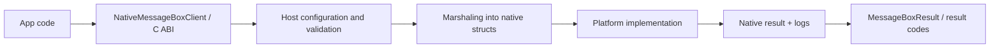

# Architecture and Request Flow

NativeMessageBox is split into a small set of clear layers so platform behavior stays isolated while the public API stays stable.

## Main Components

| Component | Role |
| --- | --- |
| Native runtime (`src/native`) | Implements per-platform dialogs for Windows, macOS, Linux, iOS, Android, and browser |
| Shared runtime helpers (`src/shared`) | Holds ABI helpers, allocator support, and runtime utility code |
| Managed wrapper (`src/dotnet/NativeMessageBox`) | Exposes typed .NET API, marshaling, host abstraction, and diagnostics |
| Samples and tests | Exercise packaging, platform integration, and high-level usage |

## Flow

## Managed Request Path

1. Application code creates <xref:NativeMessageBox.MessageBoxOptions>.
2. <xref:NativeMessageBox.NativeMessageBoxClient> resolves the current host.
3. The host validates runtime requirements such as STA or Android activity access.
4. Managed options are marshaled into the C ABI surface.
5. The native implementation presents a platform dialog.
6. The result is mapped back into <xref:NativeMessageBox.MessageBoxResult>.

## Extensibility Points

- <xref:NativeMessageBox.INativeMessageBoxHost> allows a custom host strategy.
- <xref:NativeMessageBox.NativeMessageBoxHostOptions> controls default runtime host behavior.
- The C ABI uses version and struct-size fields so additive changes stay forward-compatible.

## Why This Shape Matters

The separation keeps the API stable while still letting the project support platform-specific features such as:

- Windows Task Dialog fallbacks
- macOS accessory views
- GTK or zenity behavior on Linux
- Android activity-bound presentation
- Browser-hosted custom overlays

## Related

- [Dialog Options and Results](dialog-options-and-results.md)
- [Threading and Host Customization](../advanced/threading-and-hosts.md)
